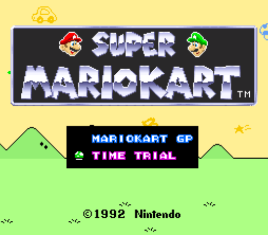
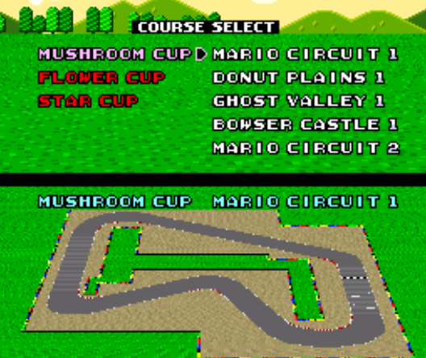
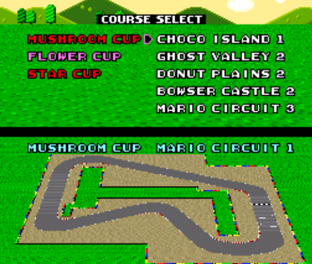
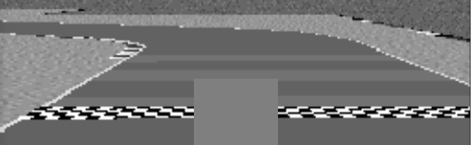
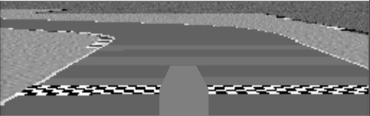
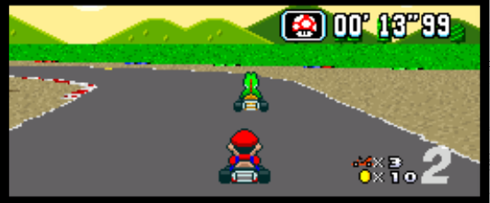

# Mario-Kart-Neural-Network
This is my repository to create a machine learning algorithm that will be able to play Super Mario Kart! As of now the model has been trained and the performance is pretty decent!

I'll explain my process below:

To begin with, I was mainly interested in doing this project to learn from start to finish how to implement a machine learning model. I enjoy games and thought applying an ML project to Super Mario Kart would be cool.

## Goal of Project

I was mainly concerned with getting the kart to drive based on images so I focused on the time trials (as opposed to the **Grand Prix**)



## Tools

- Snes9x Emulator
- Super Mario Kart ROM (make sure to have a physical copy)
- Python 64-Bit (64-bit is needed for Keras)
- Packages (found in the root of this repo as `requirements.txt`)

## Scoping

To get an idea of how I would train a model, the first thing I had to do was determine what sort of inputs I would want the model to output to the emulator. In order to do this I played the game!

I determined that the following inputs would be useful:

```
    # c (forward)                           [1,0,0,0,0,0]
    # c (forward), left                     [0,1,0,0,0,0]
    # c (forward), right                    [0,0,1,0,0,0]
    # c (forward), right, x (drift)         [0,0,0,1,0,0]
    # c (forward), left, x (drift)          [0,0,0,0,1,0]
    # no input                              [0,0,0,0,0,1]
```

I included no input as I thought I would just apply no input to slow down. Unfortunately I barely did this in training so it was an imbalanced class.

## Training Data

Further to this, I decided to train the model on only tracks from two cups:

### Mushroom Cup



### Flower Cup



My intention was to leave the **Star Cup** as a **test set**.

For about 3 minutes of training data (~30FPS,Grayscale,165x532) files were about ~350MB. Due to the size of the files I decided against RGB as the files size would be trippled. Files were saved with `np.save()`.

Training data was generated using the script `training_data.py` which uses `grap_screen()` from `win32gui_screen.py` to get the image data from the emulator.

This is an example of one piece of training data along with a label

```
array([array([[0],
       [0],
       [0],
       [0],
       [0],
       [1]]),
       array([[ 94, 129, 129, ...,  94, 100,  77],
       [ 82, 112, 112, ..., 100, 102,  77],
       [ 81, 109, 105, ...,  99,  99,  74],
       ...,
       [148, 202, 202, ...,  86,  86,  64],
       [122, 167, 167, ..., 134, 134, 101],
       [102, 139, 139, ..., 169, 169, 127]], dtype=uint8)], dtype=object)
```

As I made mistakes during training, I knew I would need some sort of tool to analyze my inputs and the corresponding images.

In order to tackle this problem I used tkinter to create a GUI and very appropriately called it `tkinter_gui.py`.

Here is an example of how it looks in action:


In particular I wanted an option to:
- load training data files
- play frames in succession (at varying FPS)
- have the ability to pause
- rewind and forward frames one by one
- enter a frame I would like to see

As you can see in the `GIF` above, all of these features are present.

The main purpose of analyzing the training data was to remove unwanted examples. Which was performed by `create_filtered_data.py`

## Cleaning the Data

As mentioned just above, `create_filtered_data.py` was used to remove unwanted samples from the raw data. However, many other scripts were used to perform various operations on the data to ensure that the raw data was transformed into data that was ready to be passed into the model. The scripts were as follows:

1. `create_filered_data.py` -> Removes unwanted examples (saves to folder `data/training_data/2-filtered`)
2. `preprocess_data.py` -> Reduces img size to 32x100 (saves to folder `data/training_data/3-processed`), and creates one large file of all training examples (saves to folder `data/training_data/4-full_data_set`)
3. `create_final_dataset.py` -> mirrors data (forward_left->forward_right, etc.) and ensure classes are balanced for training (saves to folder `data/training_data/5-final_data_set`)
4. `create_model_ready_data.py` -> creates a file of X values and a file of Y values (saves to folder `data/training_data/6-ready_for_model`)

Originally Mario was present in the image data, but upon bad performance of the model on live-testing Mario (actually getting the model to play Super Mario Kart) was removed and the model performed better. 

Here is an image with Mario:


Here is an image with Mario Removed:



The idea was that the model was looking at Mario's aspect and not at the actual track to make proper predictions.

## Creating a model

The following model was initially used:

### Model A

```
        #create model
        model = Sequential()
        #add model layers
        model.add(Conv2D(filters=layer1_filters, kernel_size=layer1_kernel, activation='relu', input_shape=input_shape))        
        model.add(MaxPooling2D(pool_size=layer1_maxpool))
        model.add(Dropout(layer1_dropout))

        model.add(Conv2D(filters=layer2_filters, kernel_size=layer2_kernel, activation='relu'))
        model.add(AveragePooling2D(pool_size=layer2_avgpool)
        model.add(Dropout(layer2_dropout))

        model.add(Flatten())

        model.add(Dense(units=layer3_units, activation='relu'))
        model.add(Dense(units=layer4_units,activation='relu'))

        model.add(Dense(units=num_classifiers,activation='softmax'))
```

The following variables were tested over a grid search to determine optimal parameters for the model:

```
Layers:

        Grid search 1 -> Layer 1:

                layer1_filters = [64,32], 
                layer1_kernel = [2,3,5], 
                layer1_maxpool = [(2,2),(3,3)], 
                layer1_dropout = [0,0.2,0.3,0.5],
        
        Grid Search 2 -> Layer 2:

                layer2_filters = [64,32],
                layer2_kernel = [2,3,5],
                layer2_avgpool = [(2,2),(3,3)], 
                layer2_dropout = [0,0.2,0.3,0.5],
        
        Grid Search 3 -> Layer 3:

                layer3_units = [4,8,16],
        
        Grid Search 4 -> Layer 4:

                layer4_units = [4,8,16],

Grid Search 5 -> Weight Initializers:

        optimizer = ['SGD', 'RMSprop', 'Adagrad', 'Adadelta', 'Adam', 'Adamax', 'Nadam']

Grid Search 6 -> Batch Size and Epochs:

        batch_size = [16,32,64]

All were performed with  the following epoch: 

        epochs = [1] # I am using 1 epoch just because I don't want to spend too much time on each possible grid

```

As explained above, there were a total of 6 grid searches. Ideally a search would have been performed over all of these variables, but that would require +32,000 possile models to assess which is just not feasible. The idea is that the global optima for each of these parameters would be the individual local optima for each grid search. The top performing grids for each search were as follows:

```
Best: 0.6870708924291142 using {'epochs': 1, 'layer1_dropout': 0.2, 'layer1_filters': 64, 'layer1_kernel': 3, 'layer1_maxpool': (2, 2)}

Best: 0.6872577372214911 using {'epochs': 1, 'layer2_avgpool': (3, 3), 'layer2_dropout': 0.5, 'layer2_filters': 32, 'layer2_kernel': 3}

Best: 0.4983887388092484 using {'epochs': 1, 'layer3_units': 16}

Best: 0.5305518816394212 using {'epochs': 1, 'layer4_units': 16}

Best: 0.6264808889918915 using {'epochs': 1, 'batch_size': 16}

Best: 0.7173503750927802 using {'epochs': 1, 'optimizer': 'RMSprop'}
```

Following these results, a further grid search was performed on the learning rate for RMSprop (note, as per Keras documentation [https://keras.io/optimizers/] only the learning rate is recommended to be tuned):

```
learn_rate = [0.0001, 0.0005, 0.001, 0.005, 0.01]
```

The results for this grid search were as follows:

```
Best: 0.7184868074014622 using {'epochs': 1, 'learn_rate': 0.001, 'optimizer': <class 'tensorflow.python.keras.optimizer_v2.rmsprop.RMSprop'>}
```

Therefore, the learning rate was best with the default value.

Now, all of these parameters were used to test the model again:

```
Epoch 10/10
51388/51388 [==============================] - 478s 9ms/sample - loss: 0.6404 - acc: 0.7554 - val_loss: 0.5736 - val_acc: 0.7838
```

This was a definite improvement over the previous model which had a 70% accuracy for both the training and validation set (note both of these models were trained with a 80:20 training validation split)

Now that the model we will use for testing has been validated, the model was trained on the entire dataset (as oposed to a 80:20 split). The following results were obtained:

```
Accuracy: 0.7613
```


An alternate model (see below) with another layer was tested but did result in a reduced accuracy (note a grid search was not performed) after training for the same amount of epochs and resulted in the same degradation in learning as the model above. Therefore this model was not used:

### Model B

```
        #create model
        model = Sequential()
        #add model layers
        model.add(Conv2D(filters=layer1_filters, kernel_size=layer1_kernel, activation='relu', input_shape=input_shape))        
        model.add(MaxPooling2D(pool_size=layer1_maxpool)
        model.add(Dropout(layer1_dropout))

        model.add(Conv2D(filters=layer2_filters, kernel_size=layer2_kernel, activation='relu'))
        model.add(MaxPooling2D(pool_size=layer2_maxpool))
        model.add(Dropout(layer2_dropout))

        model.add(Conv2D(filters=layer3_filters, kernel_size=layer3_kernel, activation='relu'))
        model.add(AveragePooling2D(pool_size=layer3_avgpool))
        model.add(Dropout(layer3_dropout))

        model.add(Flatten())

        model.add(Dense(units=layer4_units, activation='relu'))
        model.add(Dense(units=layer5_units, activation='relu'))

        model.add(Dense(units=num_classifiers,activation='softmax'))

```

## Results

When implementing the model on the actual eumulator the results are pretty good. Please see below the model in action on the following 3 tracks:

- Mario Circuit 1
- Donut Plains 1
- Ghost Valley 1

Note: Due to recording the GIFs, the performance in these GIFs was worse than when only running the model.

#### Mario Circuit 1


#### Donut Plains 1


#### Ghost Valley 1


#### Video of Model

As well, please take a look at the following video to see the model complete an entire track all by itself!

[](http://www.youtube.com/watch?v=uQtDy82_KuU "Mario Kart Neural Network in Action!")

#### Out of Sample Testing

As I mentioned earlier, I only trained on tracks from the first two cups. The intent was to see how well the model would generalize to previously unseen tracks (and thus images). Please see below for some of these tests.

##### Koopa Beach 1

Here with Koopa Beach, we can see that the model plays decently at the beginning but has issues realizing that the water is a boundary at some points (and drives right into it).


However,  if we analyze this track in grayscale we can see why the model may have some issues with this track (note: I am playing this track, not the model).

It seems that it is much harder to discern the clear edge between the track and the water, this is likely why the model makes Mario drive right into the water sometimes.


## Future Updates

There are numerous future improvements and implementations I would like to work on in the future and I will outline them here.

#### Improvements

##### 1. Find minimum graying out of image needed

As mentioned before, I grayed out Mario from each image as it seemed the NN was learning which inputs to predict based on the aspect of Mario on the screen. I believe that this is also causing some issues with sharp corners as the grayed out area on the image blocks part of the edges. Therefore, I would like to implement something like the image below that would lower the area of the grayed out image.



##### 2. Use RGB instead of Grayscale

It is possible that using RGB instead of Grayscale will allow the model to generalize better to edges such as those from __Koopa Beach__. As we've seen the boundary between the track and water is very easy to see in colour, but not in grayscale.

##### 3. Account for Momentum from Image

I wanted to incorporate some sort of way to incorporate how the velocity of pixels from frame to frame. I noticed when I was playing Super Mario Kart I would check, when drifting, when I stopped moving left or right to figure out when to straighten up. I thought letting the NN have this information would also be valuable to learning.

#### Implementations

##### 1. Grand Prix with Knowledge Engineering

While the Neural Network does a good job of driving the tracks, there is more to playing Mario Kart than that. Items are a big part of the game and so is knowing when to use each item, even depending on what place you are in.

In the example below, we would want to know the following:

1. What Item we have
2. What Place we are in
3. What inputs we are applying




1. We have a mushroom, this will give us a boost in speed
2. We know that we are in 2nd place so this means that using a mushroom would be wise
3. We know that we are currently going forward, so that means that using a mushroom would be okay and not cause us to move off track.

In the case of having an item like a red shell, it may be helpful to know if there is another racer ahead of us. This means that using this item will be effetive. In this case, object detection could be used to determine if a racer is ahead of us. If a racer was not ahead of us, then holding the shell behind us (to block other shells from hitting us) would be the wisest choice.
