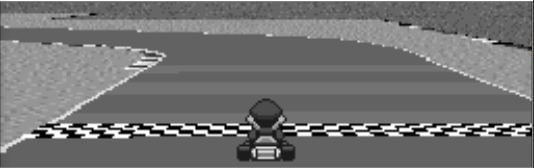

# Mario-Kart-Neural-Network
This is my repository to create a machine learning algorithm that will be able to play Super Mario Kart! As of now the model has been trained and the performance is pretty decent!

I'll explain my process below:

To begin with, I was mainly interested in doing this project to learn from start to finish how to implement a machine learning model. I enjoy games and thought applying an ML project to Super Mario Kart would be cool.

## Goal of Project

I was mainly concerned with getting the kart to drive based on images so I focused on the time trials (as opposed to the **Grand Prix**)


## Tools

- Snes9x Emulator
- Super Mario Kart ROM (make sure to have a physical copy)
- Python 64-Bit (64-bit is needed for Keras)
- Packages (found in the root of this repo as `requirements.txt`)

## Scoping

To get an idea of how I would train a model, the first thing I had to do was determine what sort of inputs I would want the model to output to the emulator. In order to do this I played the game!

I determined that the following inputs would be useful:

```
    # c (forward)                           [1,0,0,0,0,0]
    # c (forward), left                     [0,1,0,0,0,0]
    # c (forward), right                    [0,0,1,0,0,0]
    # c (forward), right, x (drift)         [0,0,0,1,0,0]
    # c (forward), left, x (drift)          [0,0,0,0,1,0]
    # no input                              [0,0,0,0,0,1]
```

I included no input as I thought I would just apply no input to slow down. Unfortunately I barely did this in training so it was an imbalanced class.

## Training Data

Further to this, I decided to train the model on only tracks from two cups:

### Mushroom Cup


### Flower Cup


My intention was to leave the **Star Cup** as a test set.

For about 3 minutes of training data (~30FPS,Grayscale,165x532) files were about ~350MB. Due to the size of the files I decided against RGB as the files size would be trippled. Files were saved as np.save.

Training data was generated using the script `training_data.py` which uses `grap_screen()` from `win32gui_screen.py` to get the image data from the emulator.

This is an example of one piece of training data along with a label

```
array([array([[0],
       [0],
       [0],
       [0],
       [0],
       [1]]),
       array([[ 94, 129, 129, ...,  94, 100,  77],
       [ 82, 112, 112, ..., 100, 102,  77],
       [ 81, 109, 105, ...,  99,  99,  74],
       ...,
       [148, 202, 202, ...,  86,  86,  64],
       [122, 167, 167, ..., 134, 134, 101],
       [102, 139, 139, ..., 169, 169, 127]], dtype=uint8)], dtype=object)
```

As I made mistakes during training, I knew I would need some sort of tool to analyze my inputs and the corresponding images.

In order to tackle this problem I used tkinter to create a GUI and very appropriately called it `tkinter_gui.py`.

Here is an example of how it looks in action:


In particular I wanted an option to:
- load training data files
- play frames in succession (at differing FPS)
- have the ability to pause
- rewind and forward frames one by one
- enter a frame I would like to see

As you can see in the `GIF` above, all of these features are present.

The main purpose of analyzing the training data was to remove unwanted examples. Which was performed by `create_filtered_data.py`

## Cleaning the Data

As mentioned just above, `create_filtered_data.py` was used to remove unwanted samples from the raw data. However, many other scripts were used to perform various operations on the data to ensure that the raw data was transformed into data that was ready to be passed into the model. The scripts were as follows:

1. `create_filered_data.py` -> Removes unwanted examples (saves to folder `data/training_data/2-filtered')
2. `preprocess_data.py` -> Reduces img size to 32x100 (saves to folder `data/training_data/3-processed'), and creates one large file of all training examples (saves to folder `data/training_data/4-full_data_set')
3. `create_final_dataset.py` -> mirrors data (forward_left->forward_right, etc.) and ensure classes are balanced for training (saves to folder `data/training_data/5-final_data_set')
4. `create_model_ready_data.py` -> creates a file of X values and a file of Y values (saves to folder `data/training_data/6-ready_for_model')

Originally Mario was present in the image data, but upon bad performance of the model on live-testing Mario was removed and the model performed better. 

Here is an image with Mario:



Here is an image with Mario Removed:


The idea was that the model was looking at Mario's aspect and not at the actual track to make proper predictions.

## Creating a model

The following model was started with and was the one what happened to work the best:

### Model A

```
        #create model
        model = Sequential()
        #add model layers
        model.add(Conv2D(64, kernel_size=5, activation='relu', input_shape=input_shape))        
        model.add(MaxPooling2D(pool_size=(2,2)))
        model.add(Dropout(0.2))

        model.add(Conv2D(32, kernel_size=3, activation='relu'))
        model.add(AveragePooling2D(pool_size=(2,2)))
        model.add(Dropout(0.5))

        model.add(Flatten())

        model.add(Dense(16, activation='relu'))
        model.add(Dense(16,activation='relu'))

        model.add(Dense(units=num_classifiers,activation='softmax'))
```

An alternate model (see below) with another layers was tested but did resulted in a reduced accuracy after training for the same amount of epochs and resulted in the same degradation in learning as the model above. Therefore this model was not used:

### Model B

```
        #create model
        model = Sequential()
        #add model layers
        model.add(Conv2D(64, kernel_size=5, activation='relu', input_shape=input_shape))        
        model.add(MaxPooling2D(pool_size=(2,2)))
        model.add(Dropout(0.2))

        model.add(Conv2D(32, kernel_size=3, activation='relu'))
        model.add(MaxPooling2D(pool_size=(2,2)))
        model.add(Dropout(0.2))

        model.add(Conv2D(16, kernel_size=2, activation='relu'))
        model.add(AveragePooling2D(pool_size=(2,2)))
        model.add(Dropout(0.5))

        model.add(Flatten())

        model.add(Dense(16, activation='relu'))
        model.add(Dense(16,activation='relu'))

        model.add(Dense(units=num_classifiers,activation='softmax'))
```

## Results


## Future Updates


